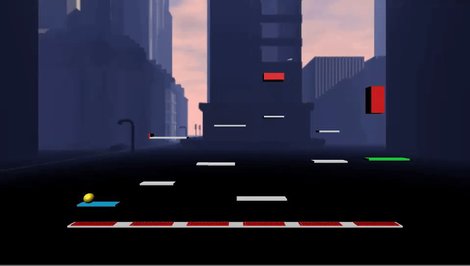

## GameJam 2018 - Bounce Platformer  "Game Impossible"

### About
* My team and I made a bounce based platform game at the University of Bristol Computer Science Society GameJam event in November 2018.
* We used the Unity Game Engine to create a game with 4 levels, each with increasing difficulty. 
* Falling on certain obstacles causes the level to restart and landing on certain platforms may lead to danger, so beware!.
* We were inspired by the classic mobile game ["Bounce"](https://en.wikipedia.org/wiki/Bounce_(video_game_series) so we decided to give it a more modern re-imagining as our Hackathon project.

### How to Run
* For ***MacOS***, clone the repository and then double click  ["Game Impossible"](Game Impossible.mac/Contents/MacOS/Game Impossible) inside the GameImpossible.mac folder.
* For ** Windows***, clone the repositry and then double click ["Game Impossible"](Game Impossible.win/Game Impossible) inside the the GameImpossible.win folder.

### Gameplay

#### Menu

#### Instructions

#### Level 1: Easy Landing

#### Level 2: Slide City

#### Level 3: High Heavens

#### Level 4: Rapids
 

### Have fun!
